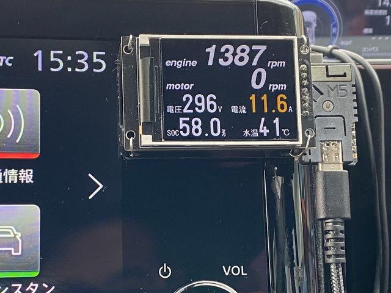
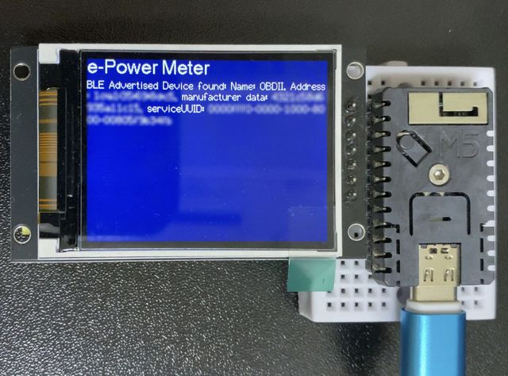

# ePowerMeter_BLE

# 概要

ELM327 v1.5 を採用したOBD2スキャナ(Bluetooth LE版)に対し、定期的にコマンドを発行し、車両情報の表示を行う<BR>

対象とする車両は、Stanislav Svistunov の Car Scanner ELM OBD2 の接続プロファイルnissan HE13(2022/09-)で接続できる車両です<BR>

（動作確認した車両は、日産 オーラ FE13）<BR>



## 注意事項

OBD2は診断プロトコルのため、診断用途で車両にアクセスすることは問題ないはずですが、常時利用を想定していないと思うので、以下の点が懸念材料となります<BR>

- CANの送受信量増大による車両側への負担
- CANからのノイズの回り込みによる車両の誤動作
- 車両環境における無線への影響

本情報は利用を促進するために公開しているわけではなく、単なる技術的なメモとして上げています<BR>

使用する場合は、自己責任でお願いします<BR>

# 回路構成

https://github.com/cosmoois/Can_ShiftIndicator の「M5STAMPC3_20」の構成を想定<BR>
- M5Stamp C3 Mate
- ST7789 2.0inch 240×320(SPI) 7pin(BLKなし)

下記のように、ブレッドボード上に直結する配線と同じです<BR>



## 回路の注意事項

M5Stampのポートの電流制限により電圧降下を起こし、ディスプレイのレギュレータの入力電圧を下げ、強引に輝度調節しています<BR>

そのため、デバイスによっては明滅する可能性があります<BR>

display_lib_240x320.cppの、backlightの値を4にすれば避けられますが、今度は明るすぎて夜間は眩しくなります<BR>

# BLEデバイスの登録

あらかじめBLEデバイスを起動しておくと、起動時のログに"BLE Advertised Device found:" のNameに「OBDII」として表示されます<BR>

このserviceUUIDで、ble_lib.cppのserviceUUIDの値を書き換えます<BR>

同様に、w_charUUID, n_charUUID も"0000fff0-"以降の値を合わせて変更します<BR>

起動時のログは以下のようなものになります<BR>

```
Starting Arduino BLE Client application...
BLE Advertised Device found: Name: OBDII, Address: 11:22:33:44:aa:bb, serviceUUID: 0000fff0-0000-1000-8000-123456789abc
Forming a connection to 11:22:33:44:aa:bb
 - Created client
 - Connected to server
 - Found our service
[  2186][E][BLERemoteCharacteristic.cpp:287] retrieveDescriptors(): esp_ble_gattc_get_all_descr: Unknown
 - Found our characteristic
canWrite
canNotify
We are now connected to the BLE Server.
```

# 表示デモについて

電源投入時にボタンを押下しておくと、レイアウト確認用の表示デモが走ります<BR>
